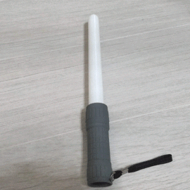
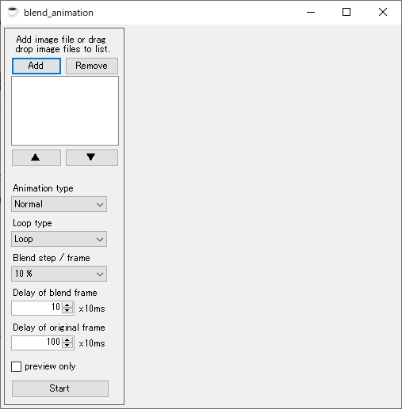

# blend_animation

 

## how to build
* Develop with VS2013
* or double-click build.bat
  * blend_animation/bin/Release/blend_animation.exe

## how to use

### Add
* Add an image file by pressing the Add button
* Or drag and drop image files into the list

### Delete
* Press the Delete button to delete the image file selected from the list

### Up/Down
* Press the ▼▲ button to change the order of the list

### Animation type / Loop type
* Loop: 1->2->3->4->1 ...
* round-trip: 1->2->3->4->3->2->1 ...
* normal: whole screen blending
* H-gradation: vertical scroll blending
* example
  * images  
 
 
 

  * normal_loop  

  * normal_round_trip  

  * h-gradation_loop  

  * h-gradation_round_trip  

### Delay of blend frames
* delay time of blend frame.(x10ms)
* For example, set 10 for 10fps

### Delay of original frame
* delay time of blend frame.(x10ms)
* For example, set 100 to display for 1 second

### Start
* Press start button to start animation
* Save file with save file dialog after playing animation
* Enable the preview only checkbox if you want to see the preview
